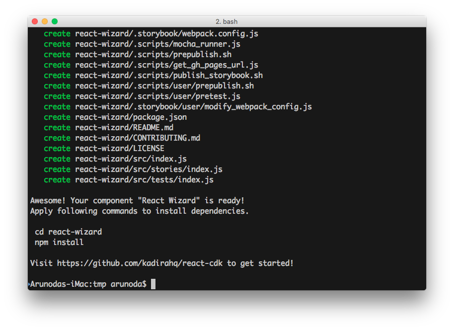
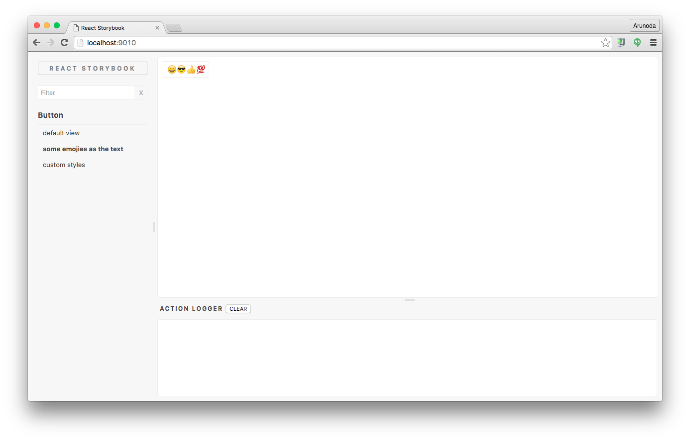

# React CDK

### Component Development Kit for React

React CDK is not just another React boilerplate. It’s much more than that, and it comes with support from [Kadira](https://github.com/kadirahq).

With React CDK, you can focus on developing your React component or utility while React CDK takes care of all the other stuff.

> Read why [Kadira created React CDK](https://voice.kadira.io/say-hello-to-react-cdk-97cff692e798#.2aaodkb6c).

React CDK comes with following features:

* Create a project with a single command.
* Write your component in [ES2016+ syntax](https://www.npmjs.com/package/babel-preset-react-app).
* Develop in a live environment with [React Storybook](https://github.com/kadirahq/react-storybook/).
* Write tests with Mocha and [Enzyme](https://github.com/airbnb/enzyme).
* Use ESLint with the [Airbnb style guide](https://github.com/airbnb/javascript).
* Publish correctly transpiled code into NPM.
* Deploy your storybook to GitHub Pages.
* Get **updates** to core building tools.

## TOC

* [Getting Started](#getting-started)
* [Developing Your Component](#developing-your-component)
* [Testing](#testing)
* [Lint Rules](#lint-rules)
* [Publishing](#publishing)
* [Deploying Storybook](#deploying-storybook)
* [CSS and Styles](#css-and-styles)
* [Updating Your Component with React CDK](#updating-your-component-with-react-cdk)
* [Customizing the Component](#customizing-the-component)

## Getting Started

Install React CDK with the following command:

```
npm install -g yo generator-react-cdk
```

> React CDK comes as a [yeoman](http://yeoman.io/) generator, which allows you to scaffold your component quickly.


Then, create your first component library with the following command:

```
yo react-cdk react-wizard
```



> React CDK will create a directory called react-wizard with all the files you need to get started.


Visit that directory and install the NPM dependencies:

```
cd react-wizard
npm install
```

By default, this project contains a simple button created with React. It also includes tests and [React Storybook](https://github.com/kadirahq/react-storybook/) stories so you can get ideas for writing your own stories.

## Developing Your Component

Now we need to work with the component. Your component lives under the src directory. Open `src/index.js` in your favorite editor and start developing.

Now, it’s time to start the Storybook so we can see what we are building:

```
npm run storybook
```

The above command starts the Storybook console on [http://localhost:9010](http://localhost:9010/).



> You can see changes you make while you are editing your component. Visit [React Storybook](https://github.com/kadirahq/react-storybook/) repo to learn more.


You can write your component in ES2015+ syntax. It supports `react` and `babel-stage2` presets.

## Testing

You can write your tests inside the `src/tests` directory. By default, the project comes with two test cases demonstrating how to write tests. React CDK configures your component with Mocha, [Enzyme](https://github.com/airbnb/enzyme), jsdom, and other essential JS testing tools.

This is the ideal way to write React tests.

You can run tests with the following commands:

* `npm run testonly` (run tests once)
* `npm run test-watch` (run tests and watch for changes)
* `npm test` (run tests and apply lint rules)

## Lint Rules

Your project is configured with ESLint based on the [Airbnb JavaScript style guide](https://github.com/airbnb/javascript) with some minor changes.

You can apply lint rules with the following commands:

* `npm run lint` (apply lint rules)
* `npm run lintfix` (apply lint rules and fix some common issues)

## Publishing

Now it’s time to publish your component to NPM. Before you publish, make sure you’ve customized the following files as necessary:

* package.json
* README.md
* CONTRIBUTE.md
* LICENSE

If everything is okay, simply publish your component to NPM with the following command:

```
npm publish
```

This command will transpile your component for ES5 before publishing it to NPM. Your component will work on any JavaScript environment.

## Deploying Storybook

You will usually write your stories while you are developing your component. That allows you to use your storybook as a living document. You could show what your component looks like and different ways to use it.

Then you can simply deploy it to GitHub Pages with the following command:

```
npm run publish-storybook
```

You can link your Storybook URL inside the README file.

Here’s a [sample component](https://github.com/kadira-samples/react-button) listing a Storybook URL.


> You can also publish your storybook automatically when you publish your component to NPM. To do that, simply add the following NPM script to your package.json file:

```js
{
  "scripts": {
    ...
    "postpublish": "npm run publish-storybook"
    ...
  }
}
```

## CSS and Styles

It’s common to include CSS and Styles with your component. There are many ways to do this. Some prefer to write CSS in JS, while some provide a CSS file that lives inside the repo.

### CSS in JS

With this approach, you don’t need to configure anything. You can just use it. However, you should make sure you accept some external styles, which allows the end user to change the look and feel of your component as needed.

### Plain old CSS files

If you are following this approach, make sure to place your CSS files inside the root of your component and not inside the src directory. Then, your end users can import it like this:

```js
import 'my-comp/style.css'
```

You may also need to load this style sheet inside your stories. Simply import the above style sheet into src/stories/index.js with the following command:

```
import '../../style.css'
```

## Updating Your Component with React CDK

This is a plain NPM module without any magic. However, it’s written in a way that allows us to push updates to your repo.

You never need to worry about updating dependencies and build tools. React CDK will take care of that.

First, update React CDK with the following command:

```
npm install -g generator-react-cdk
```

Then, visit your project and apply the following command:

```
yo react-cdk:update
```

This will update the core build tools and the package.json file for dependencies.


> It won’t update dependencies you’ve added; it will only update the dependencies and NPM script React CDK has added.

## Customizing the Component

Since your component is a plain NPM module, you can customize it any way you want. Here are some ways to do so:

### Add dependencies

You can add dependencies to the `package.json` file as needed.

### Change the JavaScript environment

Sometimes you may want to use cutting-edge JavaScript features. You can simply add the necessary Babel preset and change the `.babelrc` file.

### Change other dotfiles

You can change any of the dotfiles, including `.gitignore` and `.npmignore`.

### Customize Storybook

Sometimes you may need to customize your React Storybook. If you do, you’ll usually customize the `.storybook/webpack.config.js` file. Go ahead and do it.

### Add some pre-publish code

React CDK already uses the NPM `pre-publish` hook, so you won’t be able to use it directly. Instead, you can use `.scripts/user/prepublish.sh` to add your own code.

### Configure test utilities

We have included JSDOM(to support enzyme's [full DOM rendering](https://github.com/airbnb/enzyme/blob/master/docs/api/mount.md)) and Babel configurations before running Mocha tests. If you want to add more stuff, simply use the `.scripts/user/pretest.js` file.

### Configure something else

You can configure this project in many ways. Give it a try, and I bet you can do it without our help. If you need help from the core React CDK tools, just create [an issue](https://github.com/kadirahq/react-cdk/issues).
